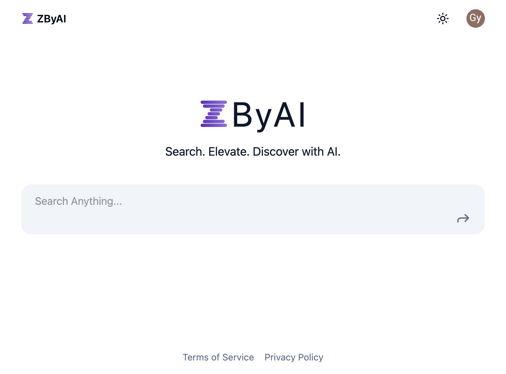
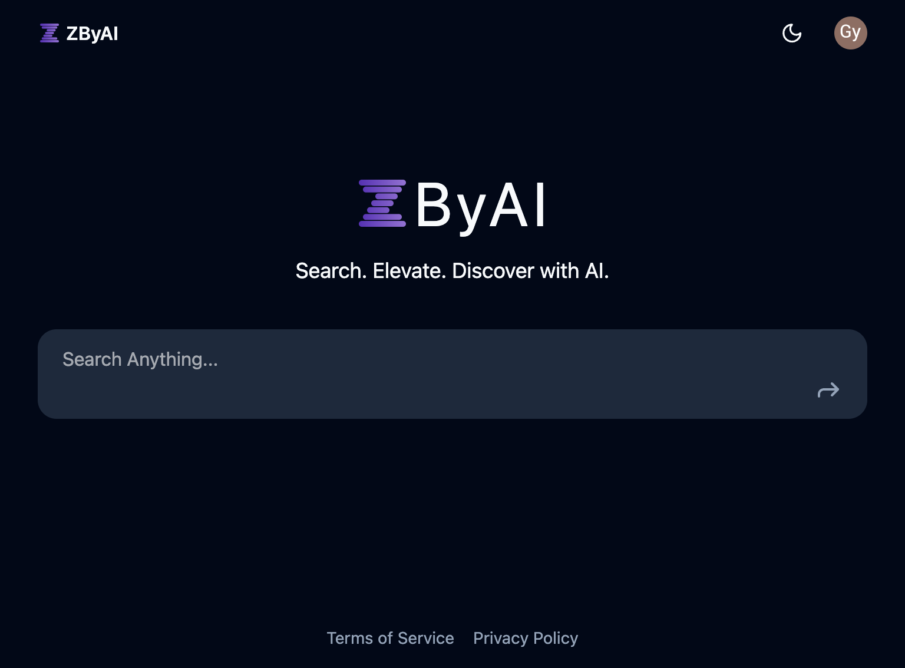

# ZByAI - AI-Enhanced Search

ZByAI is an open-source project designed as a perplexity alternative, allowing users to deploy their own AI-enhanced search service and share it with family and friends.

<div align="center">
  
  
</div>

## Features

- **Multiple Search Engines**: Supports various search engines such as Bing, Serper, and SearXNG.
- **Multiple LLM Models**: Allows the configuration of various LLMs by other LLM Provider(such as `one-api`).

## Deployment

Users can easily deploy ZByAI using Docker. The following components are required:

- **Redis** & **MySQL**: Caching layer and Database.
- **Search Engine**: Supports `Bing`, `Serper` and `SearXNG`.
- **LLM API Key**: Any llm provider.
- **Supabase Key**: For user authentication.

### Development Setup

1. Clone the repository:

   ```bash
   git clone https://github.com/zzzgydi/zbyai.git
   cd zbyai
   ```

2. Backend Configuration:

   - Copy `config/temp.yaml` to `config/dev.yaml` and fill in the necessary configurations.
   - Start the GoLang service:
     ```bash
     make dev
     ```

3. Frontend Configuration:
   - Copy `web/.env.example` to `web/.env` and fill in the required environment variables.
   - Navigate to the `web` directory and install dependencies:
     ```bash
     cd web
     pnpm i
     pnpm dev
     ```

### Production Deployment

1. Clone the repository:

   ```bash
   git clone https://github.com/zzzgydi/zbyai.git
   cd zbyai
   ```

2. Backend Configuration:

   - Copy `config/temp.yaml` to `config/prod.yaml` and fill in the necessary configurations.

3. Frontend Configuration:

   - Copy `web/.env.example` to `web/.env` and fill in the required environment variables.

4. Build Docker Images:

   - Build the backend Docker image:
     ```bash
     docker build -t zbyai-api .
     ```
   - Build the frontend Docker image:
     ```bash
     cd web
     pnpm install --lockfile-only
     docker build -t zbyai-remix .
     ```

## License

ZByAI is licensed under the MIT License. However, please note the following additional terms:

### Additional Terms:

This software is provided "as is", without warranty of any kind, express or implied, including but not limited to the warranties of merchantability, fitness for a particular purpose, and noninfringement. In no event shall the authors or copyright holders be liable for any claim, damages, or other liability, whether in an action of contract, tort, or otherwise, arising from, out of, or in connection with the software or the use or other dealings in the software.

The use of this software for direct commercial deployment is strictly prohibited without prior written consent from the authors.

## Contact

For any questions or support, please open an issue on GitHub or contact us at [hi@zbyai.com].

Enjoy using ZByAI!
